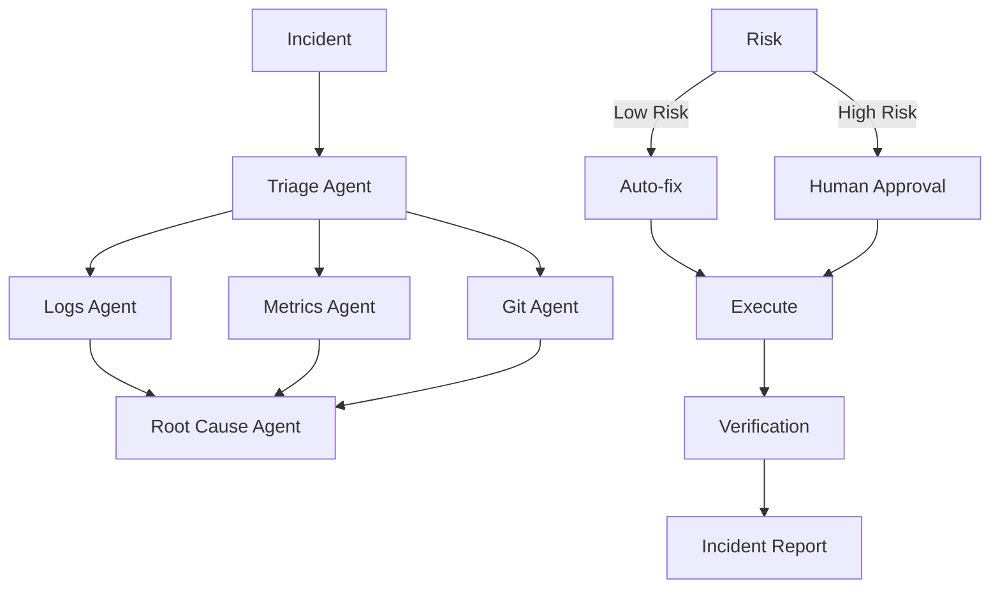

```mermaid
graph TD
    Incident[Incident] --> Triage[Triage Agent]
    
    Triage --> Logs[Logs Agent]
    Triage --> Metrics[Metrics Agent]
    Triage --> Git[Git Agent]
    
    Logs --> RCA[Root Cause Agent]
    Metrics --> RCA
    Git --> RCA
    
    Risk -->|Low Risk| AutoFix[Auto-fix]
    Risk -->|High Risk| Human[Human Approval]
    
    AutoFix --> Execute[Execute]
    Human --> Execute
    
    Execute --> Verify[Verification]
    Verify --> Report[Incident Report]
```